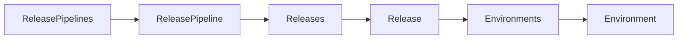
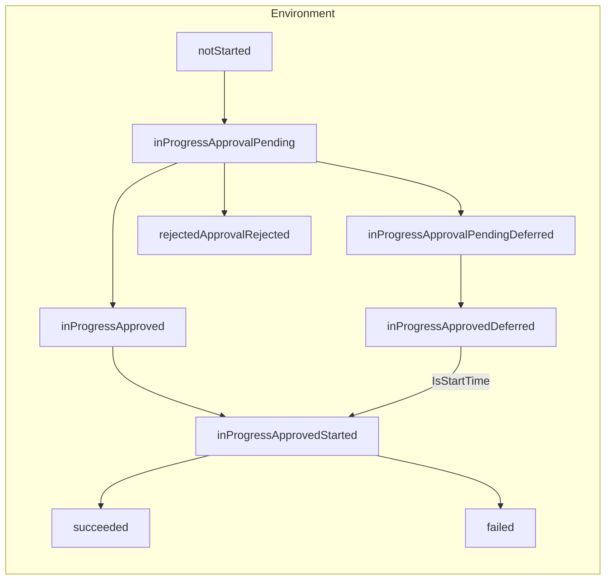

# Azure DevOps Release Explorer

Azure DevOps Release Explorer is a .NET 10 Razor Components application that surfaces Azure DevOps release pipelines in a streamlined web UI.
It wraps the Azure DevOps REST APIs so release engineers can browse pipelines, drill into releases, approve gates, kick off deployments (immediately or on a schedule) and update environment agent specifications without leaving the browser.

> This project is still very much a work in progress

## Features

- Browser-based overview of every Azure DevOps release pipeline, with quick links back to the Azure portal
- Drill-down into individual releases to inspect environments, gate status and deployment history
- Bulk and single-environment actions: approve pending approvals, start deployments, or schedule them for later
- Agent Specification dashboard to audit environments and push bulk agent specification changes
- Background worker that serialises REST calls and shields the UI from long-running Azure DevOps requests
- Environment-aware configuration via `appsettings.json` plus optional `AzureDevOps_`-prefixed environment variables

## Release Workflow





## Architecture

- **Web (Razor Components)** — Interactive server-side components in `src/AzureDevOps/Web` render pipeline lists and release details (`Main.razor`) and the Agent Specification console (`AgentSpecifications.razor`).
- **Services** — `AzureDevOpsService` in `src/AzureDevOps/Services` wraps the Azure DevOps REST API (`vsrm.dev.azure.com`). It handles authentication, GET/PATCH/PUT requests for releases, approvals and agent specs, and normalises responses into strongly-typed models.
- **Worker** — `Worker` (`src/AzureDevOps/Worker.cs`) runs as a hosted background service. UI requests are proxied through `AzureDevOpsQueryProxy`, queued on an in-memory channel
- **Models** — POCO records in `src/AzureDevOps/Models` describe release pipelines, releases, approvals and agent specification payloads.

```
src/
  AzureDevOps/
    AppSettings.cs
    AzureDevOps.csproj
    Program.cs
    Services/
    Models/
    Web/
    Worker.cs
```

## Prerequisites

- [.NET SDK 10.0](https://dotnet.microsoft.com/download)
- Azure DevOps organisation with Release pipelines
- Personal Access Token (PAT) with _Release (Read, Approve, Execute)_ and _Release (Manage)_ scopes

## Configuration

The app binds configuration from the root of `appsettings.json` and from environment variables prefixed with `AzureDevOps_`.

| Setting                      | Environment variable                     | Description                                               | Default         |
| ---------------------------- | ---------------------------------------- | --------------------------------------------------------- |-----------------|
| `PAT`                        | `AzureDevOps_PAT`                        | Base64-encoded `username:PAT` string used for Basic auth. | _(required)_    |
| `Organization`               | `AzureDevOps_Organization`               | Azure DevOps organisation short name.                     |                 |
| `Project`                    | `AzureDevOps_Project`                    | Team Project containing releases.                         |                 |
| `ApiVersion`                 | `AzureDevOps_ApiVersion`                 | Optional API version query string for GET calls.          | _(unset)_       |
| `ApiVersionForPatchRelease`  | `AzureDevOps_ApiVersionForPatchRelease`  | API version for environment PATCH operations.             | `7.2-preview.8` |
| `ApiVersionForPatchApproval` | `AzureDevOps_ApiVersionForPatchApproval` | API version for approval PATCH operations.                | `7.2-preview.3` |

> **Encoding the PAT**
> ```powershell
> $plain = ":<your-pat>"
> $bytes = [Text.Encoding]::ASCII.GetBytes($plain)
> $env:AzureDevOps_PAT = [Convert]::ToBase64String($bytes)
> ```
> Replace `<your-pat>` with the Personal Access Token value. The username portion can be left blank (Azure DevOps accepts `:<PAT>`).

## Getting Started

1. Restore dependencies:
   ```powershell
   dotnet restore AzureDevOps.sln
   ```

2. Configure secrets using environment variables (see table above). During development you can set them in your shell before launching the app:
   ```powershell
   # PowerShell example
   $env:AzureDevOps_PAT = "<base64-string>"
   $env:AzureDevOps_Organization = "my-org"
   $env:AzureDevOps_Project = "my-project"
   ```

3. Run the web app:
   ```powershell
   dotnet run --project src/AzureDevOps/AzureDevOps.csproj
   ```

4. Browse to `https://localhost:5001` (or the HTTP port shown in the console) and sign in with the configured PAT when prompted by Azure DevOps links.

For a hot-reload development loop, replace step 3 with:
```powershell
dotnet watch --project src/AzureDevOps/AzureDevOps.csproj run
```

## Azure DevOps Permissions

The PAT needs to cover any action you intend to execute from the UI:

- Reading pipelines, releases and environment details
- Approving pending approvals (`PATCH _apis/release/approvals/{id}`)
- Starting or scheduling deployments (`PATCH _apis/release/releases/{releaseId}/environments/{envId}`)
- Updating release definitions (`PUT _apis/release/definitions/{pipelineId}`)

If an API call fails because the PAT lacks rights, the UI will surface the error returned by Azure DevOps.

## UI Walkthrough

- **Release Pipelines** — Lists every release pipeline with quick links to pipeline details and the Azure DevOps portal.
- **Releases** — Shows all releases for a pipeline with navigation into a specific release.
- **Release Details** — Filter environments by name or status, approve gates, start deployments immediately, or schedule them for a future UTC timestamp. Bulk actions let you start or approve multiple environments together.
- **Agent Specifications** — Audit every environment's agent spec, select matching environments, and push single or bulk updates. Results are summarised inline after each operation.

## Background Processing

All UI commands are proxied through `AzureDevOpsQueryProxy` to the hosted `Worker`, ensuring Azure API calls are serialised. 

## Troubleshooting

- Set `Logging:LogLevel:Default` to `Debug` in `appsettings.Development.json` for verbose diagnostics.
- If scheduling fails, confirm the environment is currently `inProgress` and that you supplied a future timestamp.
